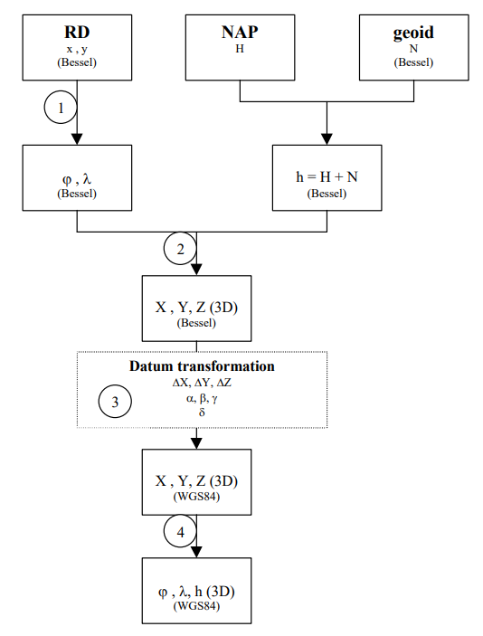
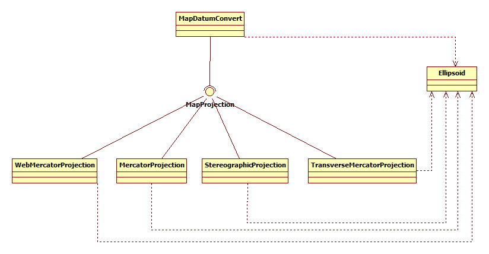

## Map Datum Convert Demo

### Goal
Demo utility that converts Rijksdriehoeksmeting coorinates to WGS84 and vice versa. It also demonstates the map projections Transverse Mercator and Oblique Stereographic (the latter is used for RD).
I wrote it for own understanding and understanding of RD in Oziexplorer.

### Code
The main flow for conversion is shown in the diagram [1.]. Step 1 is the the reverse map projection (Easting, Northing ->  lat, lon) and is implemented in the class **StereographicProjection**. The remaining steps are implemented in **MapDatumConvert**.

Main methods that execute a full conversion in **MapDatumConvert** are *rdToWgs84()* and *wgs84ToRd()*. Both map conversion classes implement the interface **MapProjection**, which contain the methods *latLonToMapDatum()* and *mapDatumToLatLon()*.

**Ellipsoid** implements an ellipoid representation. It contains the popular WGS84 and Bessel 1841 ellipsoid representations.

The software is provided with Unit Test classes, that can be used as example.

### Comparison of Stereographic and Transverse Mercator projections
OziExplorer uses the Transverse Mercator projection for Dutch topographic RD maps, since Oblique Stereographic doesn't seem to be supported. One could wonder what the error is of applying the 'wrong' projection. 

The **Main** class contains a demo. It calculates the easting and northing of the Martini Toren in Groningen according to the RD *Oblique Stereographic Projection* and the Transverse Mercator projection (that uses similar parameters as RD) and compares the result.  The easting is 5.4 m off, the northing 1.0 m. However, this error is compensated for by the map scaling, based on the Ozi reference points. Therefore the net error is limited and not noticable.

### References used
1. [A document of the Johannes Postgroep](https://www.johannespostgroep.nl/wp-content/uploads/2008/10/rijksdriehoeksstelsel.pdf)
1. [Geodetic reference frames in the Netherlands (chapter 6)](https://ncgeo.nl/downloads/43Referentie.pdf)
1. [The stereographic double projection](http://www2.unb.ca/gge/Pubs/TR46.pdf)
1. [Map Projections, a working manual](https://pubs.usgs.gov/pp/1395/report.pdf)
1. [https://cupdf.com/document/g7-2.html](OGP Surveying and Positioning Guidance Note Number 7, part 2 - 2009)
