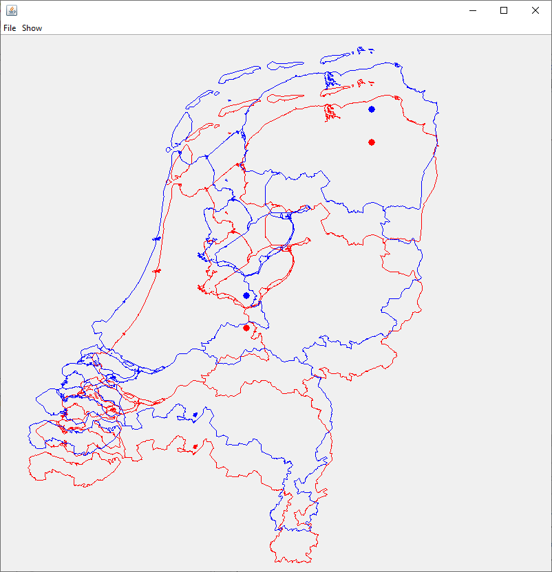

## Map Datum Convert Demo

### Goal
Demo utility that converts Rijksdriehoeksmeting coorinates to WGS84 and vice versa. It also demonstates the map projections Mercator, Web Mercator, Transverse Mercator and Oblique Stereographic (the latter is used for RD).
I wrote it for own understanding and understanding of RD in Oziexplorer and get hands on experience with map projections.

The code can be used as library, but it also contains a simple, quick and dirty demo that projects the 'landsdeel_gegeneraliseerd' data (the outline of the Netherlands) from [the PDOK dataset 'gebiedsindeling'](https://www.pdok.nl/geo-services/-/article/cbs-gebiedsindelingen). The demo allows for comparison of two projectons. On the image below: Mercator vs Web Mercator.

### Code
The main flow for Map Datum conversion is shown in the diagram. Step 1 is the the reverse map projection (Easting, Northing ->  lat, lon) and is implemented in the class **StereographicProjection**. The remaining steps are implemented in **MapDatumConvert**.

Main methods that execute a full conversion in **MapDatumConvert** are *rdToWgs84()* and *wgs84ToRd()*. Both map conversion classes implement the interface **MapProjection**, which contain the methods *latLonToMapDatum()* and *mapDatumToLatLon()*.

**Ellipsoid** implements an ellipoid representation. It contains the popular WGS84 and Bessel 1841 ellipsoid representations.

The software is provided with Unit Test classes, that can be used as example.

### Comparison of Stereographic and Transverse Mercator projections
OziExplorer uses the Transverse Mercator projection for Dutch topographic RD maps, since Oblique Stereographic doesn't seem to be supported. One could wonder what the error is of applying the 'wrong' projection. 

The **Main** class contains a demo. It uses MainView, which implement the demo projections. It calculates the difference in Map Datum coordinates (in meter) of the Martinitoren in Groningen, given the two projections to compare.

Note: the required data (the outline of the Netherlands) is downloaded on the fly from a [PDOK Web Feature Service API (WFS)](https://service.pdok.nl/cbs/gebiedsindelingen/2022/wfs/v1_0?request=GetCapabilities&service=WFS). The code also contains a method to read the data from file, but it is not used.

### References used
1. [A document of the Johannes Postgroep](https://www.johannespostgroep.nl/wp-content/uploads/2008/10/rijksdriehoeksstelsel.pdf)
1. [Geodetic reference frames in the Netherlands (chapter 6)](https://ncgeo.nl/downloads/43Referentie.pdf)
1. [The stereographic double projection](http://www2.unb.ca/gge/Pubs/TR46.pdf)
1. [Map Projections, a working manual](https://pubs.usgs.gov/pp/1395/report.pdf)
1. [OGP Surveying and Positioning Guidance Note Number 7, part 2 - 2009](https://cupdf.com/document/g7-2.html)
1. [Geomatics
Guidance Note Number 7, part 2: Coordinate Conversions and Transformations including Formulas](https://www.iogp.org/wp-content/uploads/2019/09/373-07-02.pdf)
